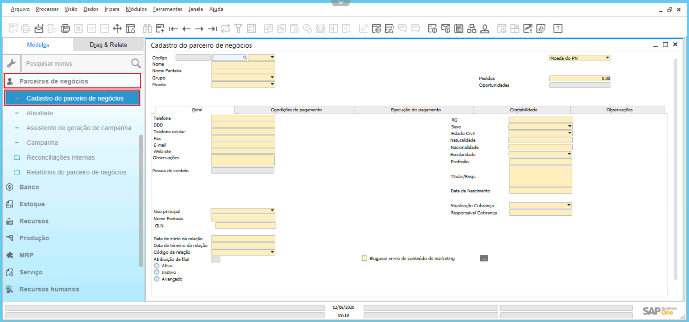

### Definição

No Menu principal do SAP Business One, selecione **Parceiros de negócios --> Cadastro de parceiros de negócios**.
A janela Cadastro do parceiro de negócios aparece no modo Procurar.

Entre os critérios de pesquisa em um ou vários campos. Os campos de pesquisa são marcados em **amarelo**.

  

A busca pelo nome pode ser realizada de diversas formas, nome completo do paciente, primeiro nome do paciente, ou apenas o sobrenome. Utilizando da ferramenta, * , o SAP irá procurar nomes relacionados ao usado na busca.

  

É apresentada uma lista com os Pacientes que correspondem aos critérios de pesquisa.
Selecione o Paciente que você pretende exibir e clique no botão Selecionar.
