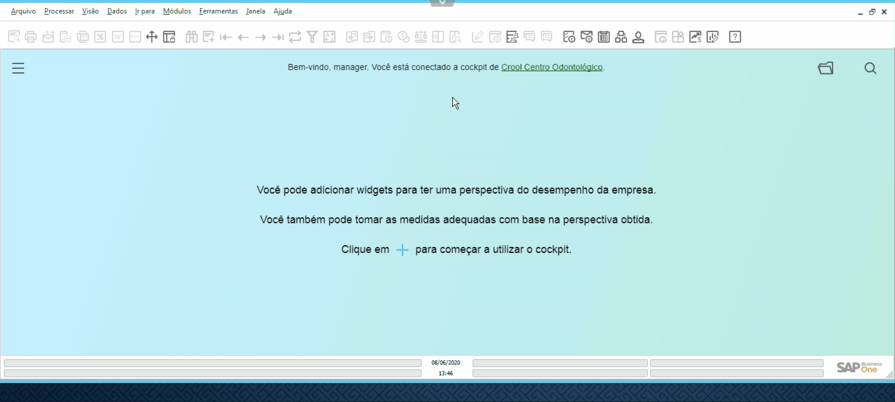

### Definição

Para realizar o download dos arquivos que estão na Nuvem, vá até a parte superior da tela, e clique na **Barra de Transferência de Arquivos**.   Clique na opção **From Server to PC** 
  
, que habilitará uma tela para selecionar o arquivo exportado pelo SAP.   Após selecionar o arquivo clique no botão Open.

  

**Observação:** O arquivo será baixado na estação de trabalho e será salvo na pasta configurada no navegador.
