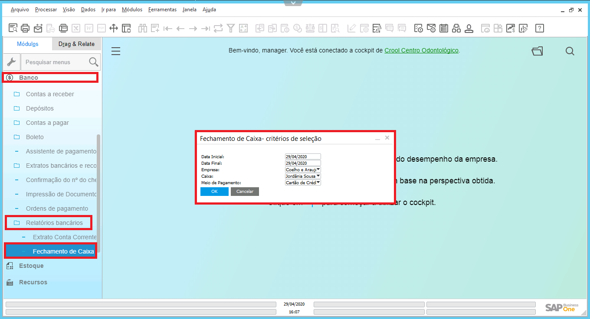
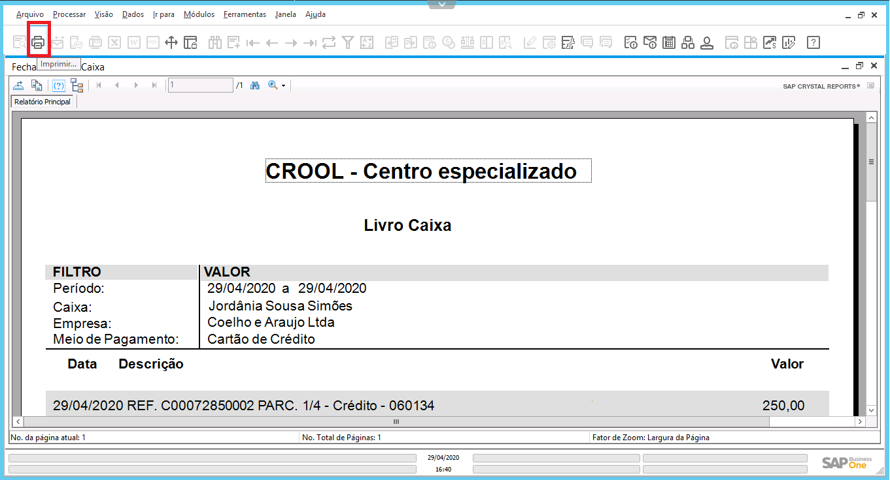
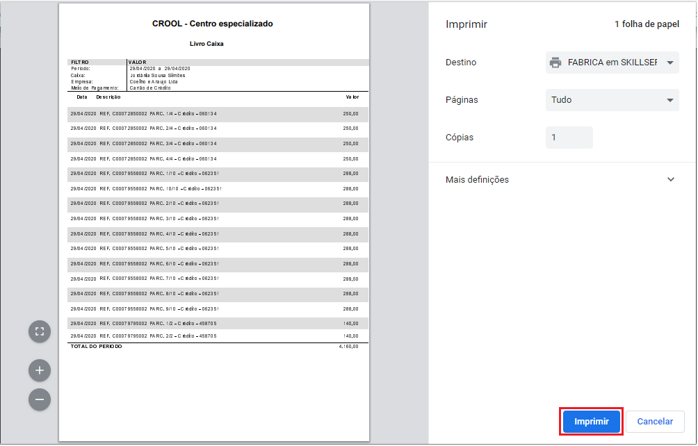

### Definição

No SAP há a possibilidade de gerar diversos relatórios. Para realizar a extração do arquivo desejado, sigas as orientações do exemplo a seguir.   Acesse o menu Fechamento de Caixa:

**Banco > Relatórios bancários > Fechamento de Caixa**

Após inserir as informações na tela habilitada, clique no botão **OK** para gerar o arquivo.

  

Localize na barra de tarefas do SAP, o botão **Imprimir** e selecione-o.

  

Clique no botão **Imprimir**.

  

