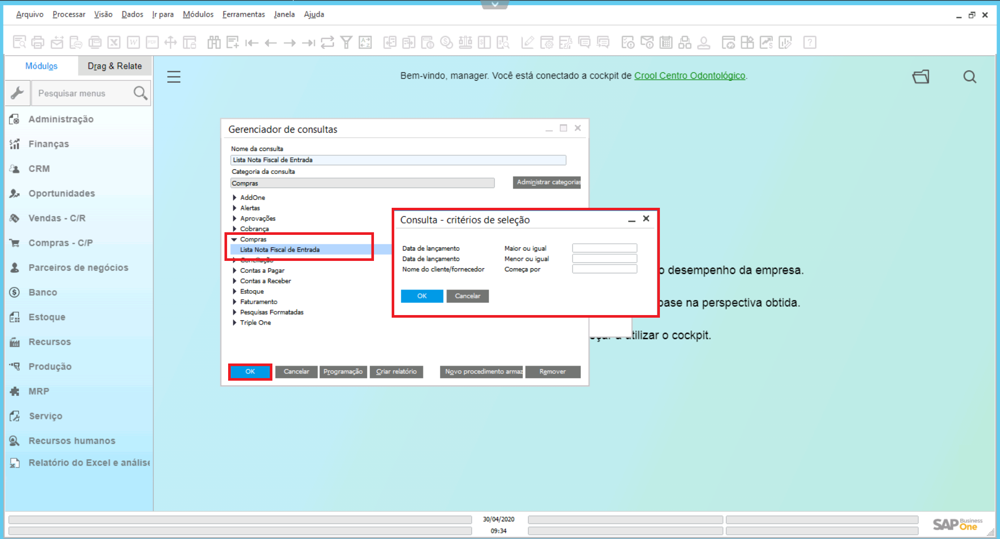

### Definição

O Gerenciador de Consultas possibilita um rápido acesso a relatórios específicos por área. Para gerar estes relatórios, clique no botão **Gerenciador de Consultas**, localizado na Barra de Tarefas do SAP.   Na tela habilitada, selecione a **Categoria** e o **Relatório** que deseja gerar. Insira as informações, conforme critério de seleção e por fim clique no botão **OK**.

  

**Observação**: É necessário ter liberação para acesso a alguns relatórios. 