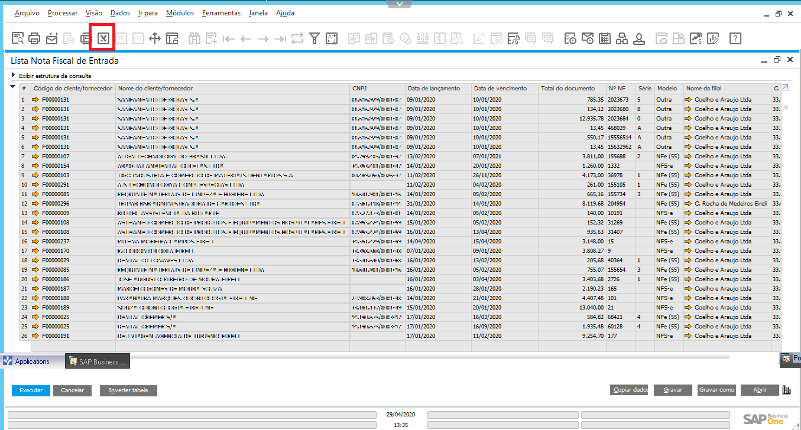
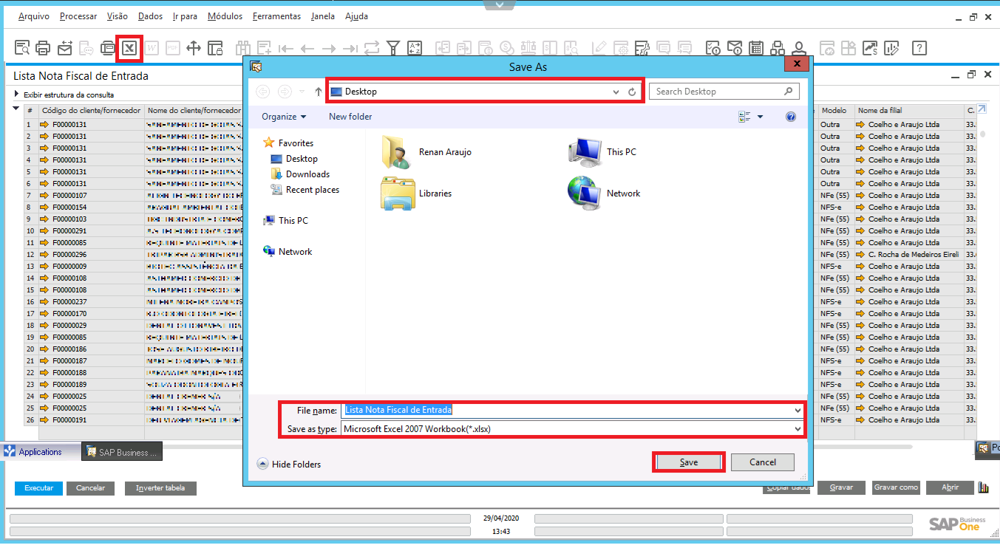

### Definição

Para realizar a extração de relatórios no formato Excel, primeiro acesse o relatório desejado e, em seguida, selecione o botão **MS-EXCEL**, na barra superior do SAP.

  

Na tela aberta, digite o nome do arquivo em **File Name**, configure a extensão deste arquivo como Microsoft Excel no campo **Save as type** e selecione o local onde deseja salvar o arquivo.  Ao final da operação clique no botão **Save**.

  

**Observação:** O arquivo será salvo na nuvem, sendo necessário baixá-lo em máquina local.