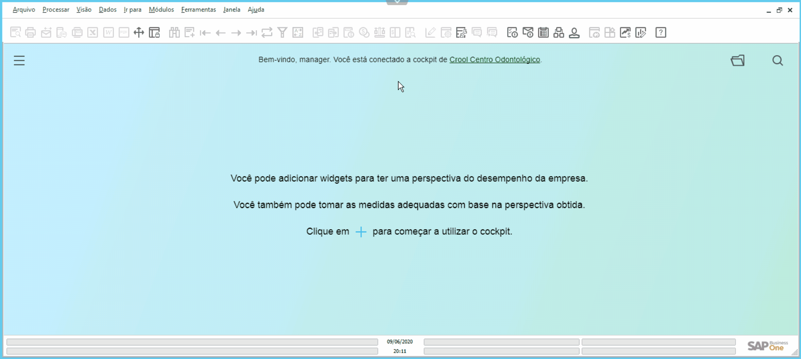

### Definição

Para enviar um arquivo para o SAP, vá até a parte superior da tela, e clique na **Barra de Transferência de Arquivos**.   Selecione a opção **From PC to Server** , que habilitará uma tela. Nela, clique na opção **Here to select your file!** e localize o arquivo que deseja enviar.   Após selecionar o arquivo clique no botão Abrir.

  

