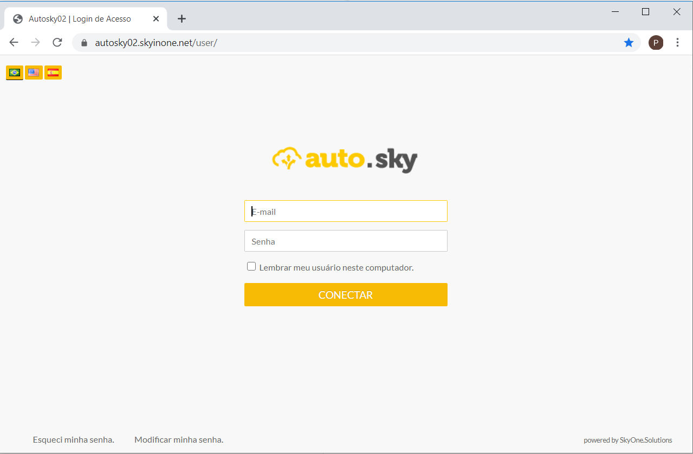
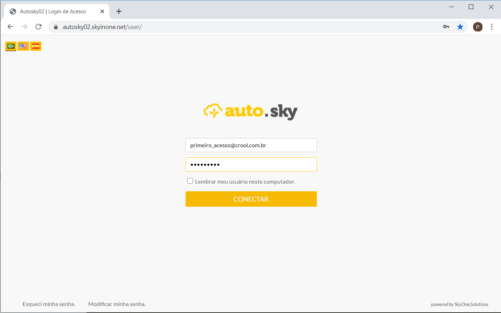

### Definição

Para iniciar o acesso no SAP, entrar no endereço: <a href="https://autosky02.skyinone.net/user/">https://autosky02.skyinone.net/user/</a>

  

No campo E-mail, informar e-mail enviado pelo TI, e a Senha inicial é Crool2020.

  

Clicar no botão **CONECTAR**.