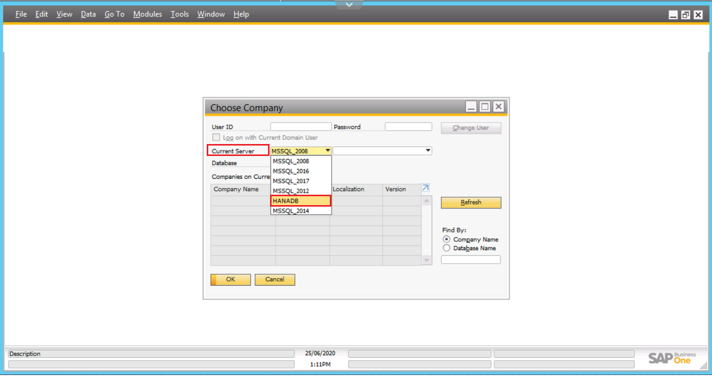

### Definição

No primeiro acesso ao SAP, deverá ser realiado as seguintes configurações.

Clicar em **Change Company**.

  

Na opção do **Current Server**, selecionar a opção **HANADB**.

  

Em **Companies on Current Server**, selecione a linha com o nome da Base de Dados
**SBO_CROOL**.   A linha com nome SBO_CROOL_HOM, é utilizada para realização de Testes.

  

Preencher o campo **User ID** com usuário enviado pelo setor de TI, em **Password** informar a senha inicial **Crool2020**.   Clicar em **OK**.

  

